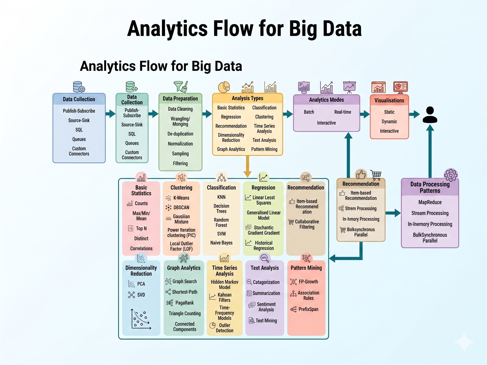

## Bid Data

Deal with collection, storage, processing and **analysis** of this massive scale data.

Specialized tools and framewoeks are requirede for big data analysis when:

1. the volume of data involved is so **large** that it is **diffiult** to **store, process** and **analyze** data on a single machine.
2. the **velocity** of data is very **high** and the data needs to be **analyzed in real-time**.
3. there is **variety of data involved**, wich can be **structured, unstructured or semi-structured,** and is collected from **multiple** data **sources.**
4. various **types of analytics** need to be performed to **extract value from the data** such as descriptive, diagnostic, predictive and prescriptive analytics.

BIG Data tools and frameworks have **distributed** and parallel processing architectures and can leverange the storage and computational resources of a large cluster of machines. 

Analitycs involves several steps starting from data cleansingm data munging **(or wranling)**, data processing and visualization.

Specialized tools and frameworks required ti ingest the data from different sources into the big data analytics backend.

Based on the analysis requerimients (bath or real-time) and type of analysis to be performed (descriptive, diagnostic, predictive or prescriptive) specilized frameworks are used.

Big data analytics is enabled by several technologies such as:

* cloud computing
* distributed and parallel processing frameworks
* non-relational databases
* in-memory computing
* etc.

### Characteristics of Big Data

#### **Volume**

Bid Data is a form of data whose volume is so large that it would not fit on a single machine therefore specialized tools and frameworks are required to store process and analyze such data.

#### **Velocity**

* Velocity of data refers to how fast the data is generated and the primary reason for the exponential growth of data.
* Results in the volume of data accumulated to become very large, in short span of time.
* Some applications can have strict deadlines for data analysis and the data needs to be analyzed in real-time.
* Specialized tools are required to ingest such high velocity data into the big data infrastructure and analyze the data.

#### **Variety**

Flexible enough to handle such Variety on the forms of the data:

* structured,
* unstructured,
* semi-structured,
* text data,
* image,
* audio,
* video and
* sensor data.

#### **Veracity**

Veracity refers to how acurrate is the data 

* To extract value form the data, the data needs to be cleaned to remove noise.
* Cleansing of data is important so that incorrect and faulty data can be filtered out.

#### **Value**

Value of data refers to the usefulness of data for the intended purpose.
The end goal of any big data analytics system is to extract value from the data.

 

{fig-cap="Figura 1: Despliegue" width="650px" fig-alt="Analytics Flow for Big Data"}

#### **Data Collection**

Before the data can be analyzed, the data must be collected and ingested into a big data stack.

The choice of tools and frameworks for data collection depends on the source of data and the type of data being ingested.

#### **Data Preparation**

Data can often be dirty and can have various issues that must be resolved before the data can be processed, such as:

* corrupted records
* missing values
* duplicates
* inconsistent abbreviations
* inconsistent utils
* typos
* incorrect spellings and
* incorrect formatting

involves various task such as:

* data cleansing
* data wrangling or munging
* de-duplication
* normalization
* sampling and
* filtering

**Data Cleansing** detects and resolves issues such as:

* corrupted records
* records with missing values
* records with bad formatting
* for instance

**Data Wrangling** or **Munging** deals with transformins the data from one raw format to another (Some file may be using comma as the field separator, others may be using tab as the field separator)

**Normalization** is required then data from different sources uses different units or scales or have different abbreviations for the shame thing.

**Filtering** and sampling may be useful when we want to process only the data that meets certain rules.

#### **Analysis Types**

Analysis types and the algorithms

#### **Analysis Modes**

to determine the analysis mode, which can be either **batch**, **real-time** or **interactive**

* The **choice** of the mode depends on the **requirements** of the application
* If your application demands results to be updated after **short intervals of time** (say every few seconds), then **real-time** analysis mode is chosen
* If your application only requires the results to be generated and updated on **larger timescales** (say daily or monthly), then **batch** mode can be used
* If your application demands **flexibility to query data** on demand, then the interactive mode is useful

Once you make a choice of the analysis type and the analysis mode, you can **determine the data processing pattern** that can be used

**The choice of the analysis type, analysis mode, and the data processing pattern can help you in shortlisting the right tools and frameworks for data analysis**

#### **Visualizations**

The choice of the **visualization tools**, serving **databases** and web **frameworks** is **driven** by the **requirements** of the application.

* **Static** visualizations are used when you have the analysis **results stored** in a serving **database** and you simply want to display the results.
* If your application demands the results to **updated regularly**, then you would require **dynamic** visualizations.
* If you want your application to accept inputs from the user and display the results, then you would require **interactive** visualizations.

#### **Raw Data Sources**

Before the data is processed and analyzed, it must be captured from the **raw data sources** into the big data systems and frameworks.

Aquí tienes el texto extraído de la imagen **image.png**:

### **Raw big data sources include:**

* **Logs** generated by web applications and servers which can be **used** for performance monitoring
* **Transactional Data:** Transactional data generated by applications such as eCommerce, Banking and Financial
* **Social Media:** Data generated by social media platforms
* **Sensor Data:** Sensor data generated by **Internet of Things** (IoT) systems
* **Clickstream Data:** Clickstream data generated by web applications which can be used to **analyze browsing patterns** of the users
* **Surveillance Data:** Sensor, image and video data generated by **surveillance** systems
* **Healthcare Data:** Healthcare data generated by **Electronic Health Record** (EHR)
* **Network Data:** Network data generated by network devices such as **routers** and **firewalls**

### **Data Access Connectors**

Include tools and frameworks for collecting and **ingesting** data from various sources into the big data **storage** and analytics **frameworks**.

The choice of the data connector is driven by the **type of the data source**.

### **Publish-Subscribe Messaging:**

* Publish-Subscribe is a communication model that involves **publishers, brokers** and **consumers**.
* Publishers are the **source** of data.
* Publishers **send** the data to the topics which are managed by the broker

### **Source-Sink Connectors:**

Source-Sink connectors allow efficiently **collecting, aggregating** and **moving** data from various sources into a **centralized data store**

### **Database Connectors:**

Database connectors can be used for **importing data** from relational database management systems **into big data storage** and analytics frameworks for analysis

## Big Data Traducción

Tratan sobre la recolección, el almacenamiento, el procesamiento y el **análisis** de datos a esta escala masiva.

Se requieren herramientas y marcos especializados para el análisis de Big Data cuando:

1. el volumen de datos involucrado es tan **grande** que es **difícil** **almacenar, procesar** y **analizar** los datos en una sola máquina.  
2. la **velocidad** de los datos es muy **alta** y los datos necesitan ser **analizados en tiempo real**.  
3. existe **variedad** de datos, que puede ser **estructurada, no estructurada o semiestructurada**, y se recopilan de **múltiples** **fuentes** de datos.  
4. es necesario realizar diversos **tipos de análisis** para **extraer valor de los datos**, como análisis descriptivo, diagnóstico, predictivo y prescriptivo.

Las herramientas y marcos de Big Data disponen de arquitecturas de procesamiento **distribuido** y paralelo, y pueden **aprovechar** el almacenamiento y los recursos computacionales de un gran clúster de máquinas.

El análisis implica varios pasos, desde la limpieza de datos, el **munging** de datos **(o wrangling)**, el procesamiento de datos y la visualización.

Se requieren herramientas y marcos especializados para ingerir los datos de diferentes fuentes en el backend de análisis de Big Data.

Según los requisitos de análisis (por lotes o en tiempo real) y el tipo de análisis a realizar (descriptivo, diagnóstico, predictivo o prescriptivo), se utilizan marcos especializados.
El análisis de Big Data es habilitado por varias tecnologías, como:

* computación en la nube
* marcos de procesamiento distribuido y paralelo
* bases de datos no relacionales
* computación en memoria
* etc.

### Características de Big Data

#### **Volumen**

Big Data es una forma de datos cuyo volumen es tan grande que no cabría en una sola máquina, por lo que se requieren herramientas y marcos especializados para almacenar, procesar y analizar dichos datos.

#### **Velocidad**

* La velocidad de los datos se refiere a la rapidez con que se generan los datos y es la razón principal del crecimiento exponencial de los datos.
* Resulta en que el volumen de datos acumulados se vuelva muy grande en un corto período de tiempo.
* Algunas aplicaciones pueden tener plazos estrictos para el análisis de datos y los datos necesitan ser analizados en tiempo real.
* Se requieren herramientas especializadas para ingerir tales datos de alta velocidad en la infraestructura de Big Data y analizar los datos.

#### **Variedad**

Lo suficientemente flexible para manejar tal variedad en las formas de los datos:

* estructurados,
* no estructurados,
* semiestructurados,
* datos de texto,
* imagen,
* audio,
* video y
* datos de sensores.

#### **Veracidad**

La veracidad se refiere a qué tan precisos son los datos.

* Para extraer valor de los datos, los datos necesitan ser limpiados para eliminar ruido.
* La limpieza de datos es importante para que los datos incorrectos y defectuosos puedan ser filtrados.

#### **Valor**

El valor de los datos se refiere a la utilidad de los datos para el propósito previsto.
El objetivo final de cualquier sistema de análisis de Big Data es extraer valor de los datos.

 

{fig-cap="Figura 1: Despliegue" width="650px" fig-alt="Flujo de Análisis para Big Data"}

#### **Recolección de Datos**

Antes de que los datos puedan ser analizados, los datos deben ser recolectados e ingeridos en una pila de Big Data.

La elección de herramientas y marcos para la recolección de datos depende de la fuente de datos y del tipo de datos que se están ingiriendo.

#### **Preparación de Datos**

Los datos pueden ser frecuentemente sucios y pueden tener varios problemas que deben ser resueltos antes de que los datos puedan ser procesados, tales como:

* registros corruptos
* valores faltantes
* duplicados
* abreviaturas inconsistentes
* unidades inconsistentes
* errores tipográficos
* deletreos incorrectos e
* formato incorrecto

Implica varias tareas tales como:

* limpieza de datos
* wrangling o munging de datos
* de-duplicación
* normalización
* muestreo y
* filtrado

#### **Limpieza de Datos** detecta y resuelve problemas tales como:

* registros corruptos
* registros con valores faltantes
* registros con formato incorrecto
* por ejemplo

**Wrangling** o **Munging de Datos** se ocupa de transformar los datos de un formato crudo a otro (algunos archivos pueden estar usando coma como separador de campo, otros pueden estar usando tabulación como separador de campo)

**Normalización** es requerida cuando los datos de diferentes fuentes utilizan diferentes unidades o escalas o tienen diferentes abreviaturas para lo mismo.

**Filtrado** y muestreo pueden ser útiles cuando queremos procesar solo los datos que cumplen con ciertas reglas.

#### **Tipos de Análisis**

Tipos de análisis y los algoritmos

#### **Modos de Análisis**

para determinar el modo de análisis, que puede ser **por lotes**, **en tiempo real** o **interactivo**

* La **elección** del modo depende de los **requisitos** de la aplicación
* Si su aplicación demanda que los resultados se actualicen después de **intervalos cortos de tiempo** (digamos cada pocos segundos), entonces se elige el modo de análisis **en tiempo real**
* Si su aplicación solo requiere que los resultados se generen y se actualicen en **escalas de tiempo más grandes** (digamos diarios o mensuales), entonces se puede usar el modo **por lotes**
* Si su aplicación demanda **flexibilidad para consultar datos** bajo demanda, entonces el modo interactivo es útil

Una vez que hace una elección del tipo de análisis y del modo de análisis, puede **determinar el patrón de procesamiento de datos** que se puede usar

**La elección del tipo de análisis, el modo de análisis y el patrón de procesamiento de datos puede ayudarle a filtrar las herramientas y marcos correctos para el análisis de datos**

#### **Visualizaciones**

La elección de las **herramientas de visualización**, bases de datos **servidoras** y **marcos** web está **impulsada** por los **requisitos** de la aplicación.

* Las visualizaciones **estáticas** se utilizan cuando tiene los **resultados del análisis almacenados** en una **base de datos** servidora y simplemente desea mostrar los resultados.
* Si su aplicación demanda que los resultados se **actualicen regularmente**, entonces requeriría visualizaciones **dinámicas**.
* Si desea que su aplicación acepte entradas del usuario y muestre los resultados, entonces requeriría visualizaciones **interactivas**.

#### **Fuentes de Datos Raw**

Antes de que los datos sean procesados y analizados, deben ser capturados de las **fuentes de datos raw** en los sistemas y marcos de Big Data.