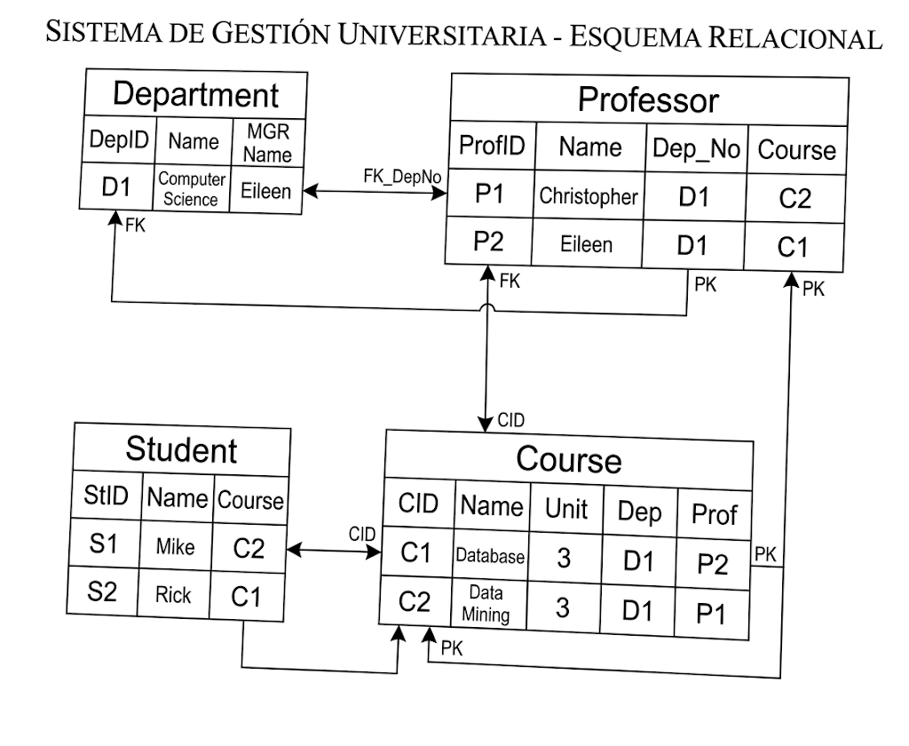
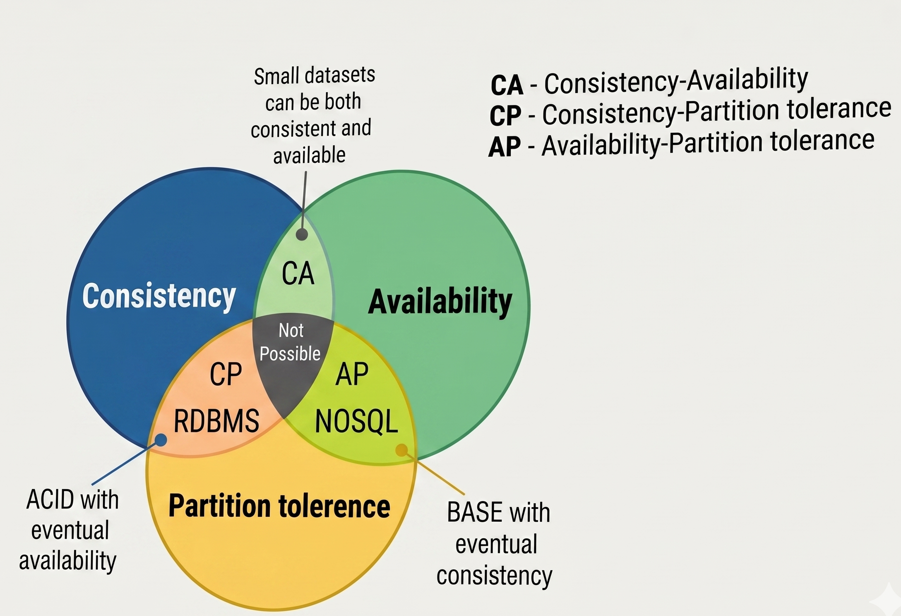

## **Big Data**

Una DB es una colección de datos **organizados** para facilitar y acelerar su acceso, un formato **estandarizado**.

La interfaz entre la DB, Sistema de Gestión de Base de datos (**DBMS**).

Los DBMS están clasificados de acuerdo a varios aspectos:

* el **modelo de datos** que se aplica.
* el **lenguaje de consultas** que se provee.
* el **hardware** que se requiere.
* el **diseño interno**.
* su **desempeño** y **escalabilidad**.

El modelo de datos define la estructura lógica *ie.*, el modelo de datos estandariza **cómo los elementos de datos se relacionan entre sí**.

Las DB pueden ser consideradas como: **navegacionales, relacionales** y no relacionales (**NoSQL**).

### **Navegacionales Desuso**

Cuando las DB se almacenaban en **cintas magnéticas**, se necesita navegar a través de los datos.

Las referencias a la ubicación incluida en estructuras de datos básicas.

### **DB Relacionales**

Es una descripción matemática de la **teoría de conjuntos** llamada **álgebra relacional.**

Se usa el Lenguaje Estructurado de Consultas - **SQL** - para interactuar con este tipo de DB.

Los datos están organizados a través de relaciones (*ie*, **tablas**) compuesta de tuplas (*ie*, **registros**) los cuales mapean **atributos** a valores atómicos de longitud limitada.

 

{fig-cap="Figura 1: Despliegue" width="350px" fig-alt="Tabla de bases de datos"}

 

Las transacciones tienen características conocidas como **ACID**:

* **Atomicidad**, si la transacción falla la DB es devuelta a su estado anterior (**rollback**).
* **Consistencia**, una DB es llevada de un **estado consistente** a otro estado consistente. **Los estados intermedios pueden se no consistentes.**
* **Aislamiento**, las transacciones **concurrentes** no se afectan entre sí.
* **Durabilidad**, los **cambios** realizados por una transacción se vuelven **permanentes**.

### **NoSQL**

El **uso masivo de las aplicaciones web** dio como resultado **nuevos requerimientos** para las bases de datos.

**No** pueden ser satisfechos por las DB convencionales.

El término NoSQL se usa de forma genérica para todas las DB que se **diferencian de las DB relacionales.**

Aquí tienes el texto extraído de la imagen **image_3.png**:

### **Características:**

* No se requiere de un esquema fijo de tablas y registros, se pueden tener **varios modelos**: **llave-valor**, basado en **columna**, basado en **grafos** y basado en **documentos**.
* Escalamiento horizontal, la mayoría de estas DB permiten el **particionamiento** de los datos y su **procesamiento** sobre **varios nodos**.
* Soporte de **multiprocesadores**: diseñados para trabajar ***n*** máquinas **multoprocesador**, al agregar mas procesadores se puede obtener un **escalamiento lineal en el desempeño**.
* Eliminación de operaciones de unión (**join**).
* Soporte modelos débiles de concurrencia, muchas de las DB NoSQL **relajan aspectos de las transacciones ACID**.
* Son DB sin esquemas, **los datos se almacenan sin un esquema fijo**, se pueden agregar nuevos campos a los registros.
* Arquitectura **compartir-nada**, muchas NoSQL son diseñadas para ser **funcionales en un clúster**, donde **no se comparte memoria ni discos**.

Aquí tienes el texto extraído de la imagen **image_4.png**:

## NoSQL Características

El surgimiento del BD es muy demandante para las DB.
Algunos **requerimientos** exceden las capacidades de las DB tradicionales.
**Accesibilidad**, **disponibilidad**, y **balanceo de cargas** en servidores distribuidos geográficamente.

### **Propiedades** en un sistema distribuido de datos:

* **Consistencia**: propagación de la misma actualización de los datos a todos los nodos. Se garantiza la consistencia de datos en todas las particiones replicadas de a DB.
* **Disponibilidad**: Debe estar disponible, aún en casos de falla de comunicación, gracias a las replicaciones en la DB.
* **Tolerancia** de las particiones, habilidad de dos segmentos del sistema (particiones) de **proceder ante la presencia de fallas** de comunicación.
* Mientras **mas tolerancia** a fallas se tenga, la DB está **mas disponible**, sin embargo, la accesibilidad de dato es menos consistente y viceversa.

Es **imposible** asegurar **tres** propiedades al mismo tiempo en un sistema distribuido de datos (**máximo dos** de ellas).

 

{fig-cap="Figura 1: Despliegue" width="350px" fig-alt="Esquema"}

 

El **balance** en el ajuste de esas propiedades depende de los **requerimientos** de la aplicación.

Toda aplicación BD en un sistema distribuido de datos tiene que hacer un acuerdo entre **disponibilidad** y **consistencia**.

Para la mayoría de las **aplicaciones web** la **disponibilidad** es crucial.

No disponibilidad o aplicaciones lentas puede provocar **pérdida de clientes**.

Las aplicaciones web **no son transaccionales**.

## **Notas**  

* SQL → Structured Query Language, lenguaje de consulta estructurado.

## **Glosario**

- **DB** → Base de datos.
- **BD** → Big Data.