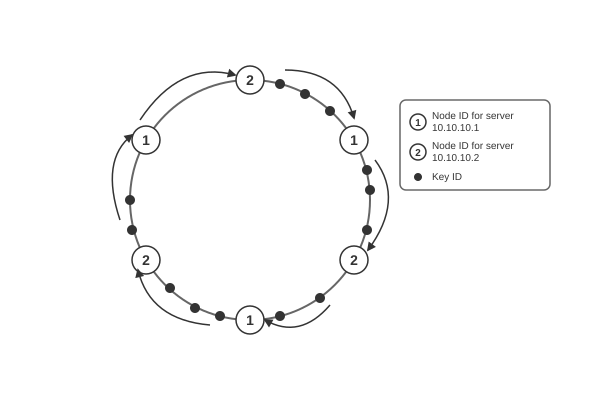
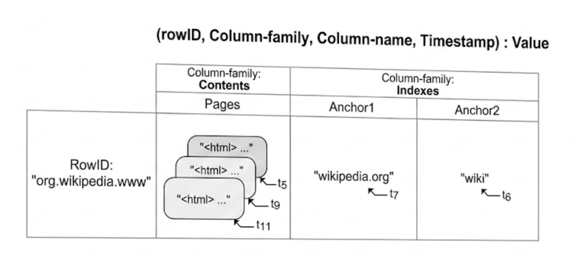
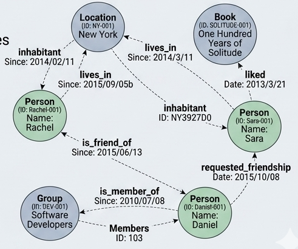
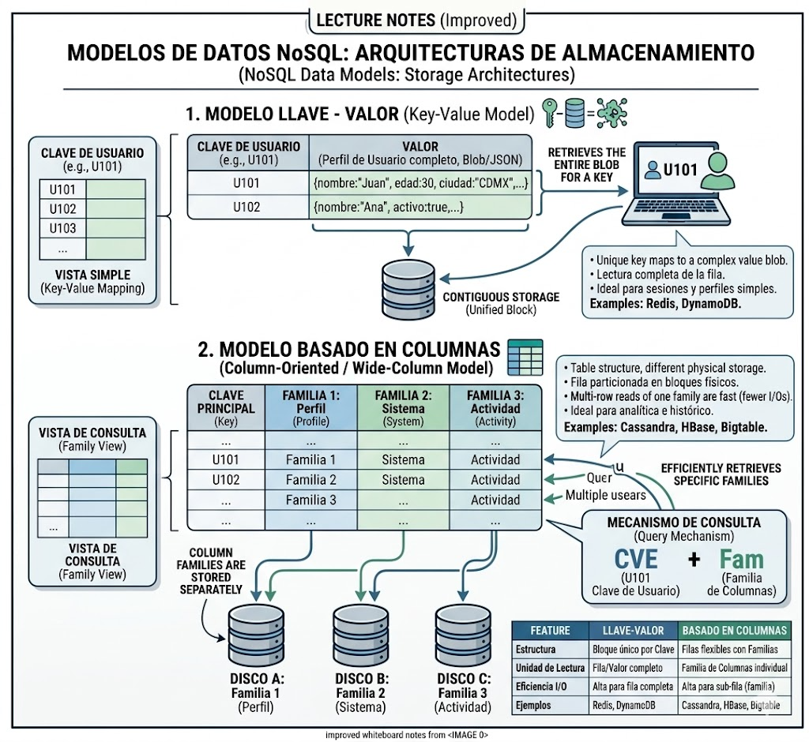
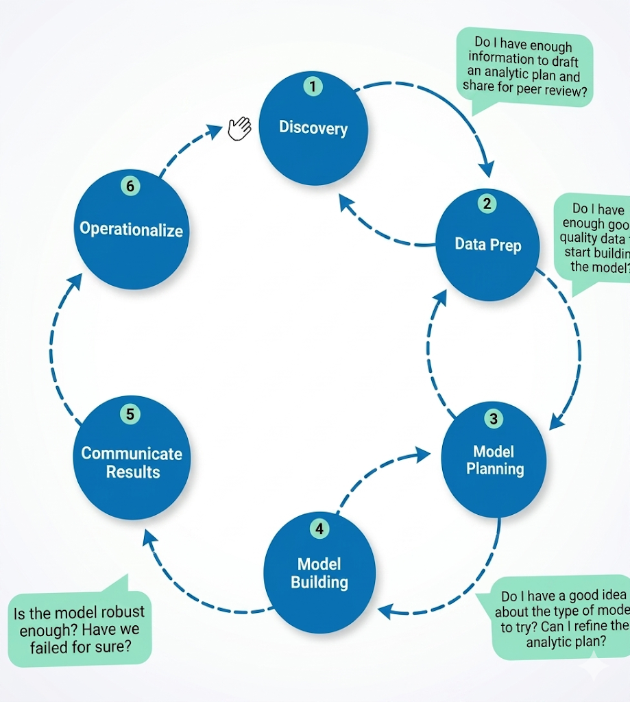
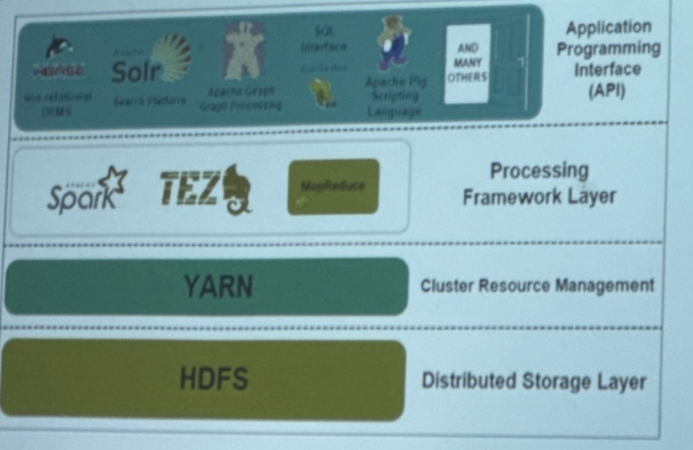

Se requiere de un **método escalable** para la **distribución** de claves sobre el clúster.

El método más común es el de **consistente hashing**.

La idea es mapear las claves y nodos sobre el mismo espacio de nombres alredeor de un anillo.

 

{fig-cap="Figura 1" width="350px" fig-alt="Diagrama 1"}

 

Los identificadores se definen aplicando una función hash sobre un esquema de direcciones de nodo, por **ejemplo la dirección IP y el valor de la llave**.

**Nota:** Las tablas Hash son una estructura de datos que mapea claves a valores, usando una función hash para calcular un índice en una matriz de cubetas o ranuras, desde donde se puede encontrar el valor deseado.

Una forma de mapear las llaves sobre un servidor especifico es asignar todas las ID de las llaves entre dos nodos en el sentido del reloj sobre el siguiente ID de nodo.

Debido a que los ID de los nodos son producidos aplicando el método hash a las IP, **se puede tener dos identificadores de nodo cercanos entre sí**.
Se mapean múltiples puntos en lugar de mapear solo un punto por cada ID.

### Basado en columnas

Mantienen columnas juntas, permitiendo más flexibilidad.

**No todos los atributos deben tener valor** para cada renglón de datos y **cada célula puede incluir más de un valor.**

La clave puede tener un **número arbitrario de atributos** combinados.

Permite una rápida agregación de datos con **menos I/O.**

Es un **modelo híbrido de renglón y columna**, la clave sirve para hacer búsquedas de datos.

La clave es una combinación de uno o más atributos.

 

{fig-cap="Figura 2" width="350px" fig-alt="Diagrama 2"}

 

Se agrega una **marca de tiempo** a los atributos para el manejo de **versiones** de los datos.

Cada célula conserva **diversos valores** de datos a través del tiempo.

Los datos en este tipo de DB pueden ser **ordenados con parte de la clave**, usualmente por la columna familia.

Es una forma de **identificar** cuáles **columnas** pueden ser almacenada juntas.

Provee escalabilidad para manejar grandes volúmenes de datos, haciéndolo un modelo sólido en la familia de DB NoSQL

La escalabilidad se basa en dividir **renglones** (escalabilidad **horizontal**, compartiendo la clave primaríamos)

**Columna (escalabilidad vertical)** a través de la distribución de familias de columnas sobre múltiples nodos. 

### Basado en grafos

Almacena **secuencias de vértices** y relaciones que **forman una gráfica**.

Su interés principal es la relación entre los elementos de los datos.

Las **estructura de datos** están compuestas de tres **elementos: vértices**, relaciones(**ejes**) y propiedades(**colores**).

Cada vértice es **una entidad** la cual contiene varios **atributos** (pares **clave-valor**).

**Objetos** representando el **mundo real**, tales como personas, números de télefono, etc.
Los **vértices** usualmente son representados con **círculos** en los diagramas.

Los **ejes** enlazan vértices y muestran las **relaciones** entre ellos.

**Cada relación tiene un tipo y una dirección, de inicio a fin del vértice.**

El grafo contiene ***propiedad** relacionada con los vérticces y las relaciones.

 

{fig-cap="Figura 3" width="350px" fig-alt="Diagrama 2"}

 

Las propiedades de los vértices pueden ser usadas para representar el **rol** en el **dominio** o agregar **meta-datos** (índices) a los vértices.

Las **propiedades** de las relaciones son, mayormente **cuantitativas** tal como intervalos de **tiempo, distancia, costos, etc.**

Este tipo de DB provee un **esquema sin estructura** y una solución eficiente de almacenamiento de **datos semi-estructurados.**

Técnica gráfica de procesamiento llamada "libre de índice adyacentes".

Esta técnica está basada en que los vértices tienen **punteros** a los vértices **adyacentes**

Los vértices saben la **ubicación de sus vecinos** inmediatos **sin** necesidad de ejecutar una **búsqueda** de índices.

Permite viajar por el grafo de forma eficiente, **costo de la búsqueda** usando un índice binario en un árbol de tamaño n, es **O(log n)**

Este tipo de DB son útiles en aplicaciones que necesitan analizar **relaciones** o

En las que rápidamente deben **encontrar una estructura compleja** de una red o para **hallar un patrón** dentro de esas estructuras.

Ejemplos son las **redes sociales**, administración de **redes** y en la nube, **seguridad** y control de acceso y aplicaciones **basados en reglas**.

### Basada en documentos

Almacena los **datos** en forma de **documentos**.

Los documentos pueden ser **cualquier objeto sin referencias**.

Formatos estándar de **anotado simple**: JavaScript Object Notation, o Extensible Markup Language.

Cada documento contiene **diversos campos** con valores asociados (parecido a una estructura **llave-valor**)

Los documentos son agrupados en **directorios**, comúnmente llamados **colecciones**

Agrupados por **similitud lógica** (medidas de similitud)

Los **documentos** son el equivalente a los **registros** en el modelo relacional y las **colecciones** son similares a las **tablas**.

La diferencia es que los registros en la misma DB contienen un **número fijo de atributos** y tienen que almacenar atributos con **valor vacío**

**Los campos de los documentos no están** predefinidos y pueden ser similares o diferentes **de un documento** a otro dentro de la colección

Se tiene un almacenamiento de **estructuras de datos sin esquema.**

 

{fig-cap="Apunte" width="550px" fig-alt="Apunte"}

 

Los campos no solo contienen valores escalares, pueden incluir otro documento o una lista como sus valores.

Anidadni un documento dentro de otro se llama **embeding**

Se permite la **transacción por documento**, pero no a niivel multidocumento.

Para incrementar la localidad de datos, atomicidad y aislamiento a nivel documento se puede usar *embedding*.

\newpage

## Data Analytics Lifecycle

The lifecycle has six phases, and project work can occur in several phases at once.

The Data Analytics Lifecycle defines analytics process best practices spanning discovery to project completion

 

{fig-cap="Diagrama" width="550px" fig-alt="Diagrama"}

 

### Phase 1: Discovery

The data science team must:
* **learn** and **investigate** the problem,
* **develop** context and understanding,
* and **learn** about the data **sources** needed and available for the project.
* **formulates** initial **hypotheses** that can later be tested with data.

**Learning** the Business Domain

**Understanding** the domain area of the problem is essential.

**Data scientists** will have deep computational and quantitative knowledge that can be broadly applied across many disciplines

These data scientists have deep knowledge of the **methods, techniques**, and ways for applying **heuristics** to a variety of business and conceptual problems.

At this early stage in the process, the team needs to determine how much **business or domain knowledge the data scientist needs to develop** models in Phases 3 and 4.

## Resources

The team needs to **assess the resources** available to support the project.

Resources include technology, **tools, systems, data,** and **people**.

Try **to evaluate the level of analytical sophistication** within the organization and **gaps** that may exist related to **tools, technology,** and **skills**

**For the model to have longevity in an organization, consider what types of skills and roles will be required that may not exist today**

For the project to have long-term success, what types of **skills** and roles will needed for the recipients **of the model being developed?**

Does the requisite level of expertise **exist within the organization** today, or **will it need to be cultivated?**

Consider if the **data available is sufficient** to support the project's goals.

The team will need to **determine** whether it must **collect additional data, purchase** it from outside sources, or **transform** existing data.

**When the data is less than hoped for, the size and scope of the project is reduced to work within the constraints of the existing data.**

**Longer-term goals along with short-term goals** enables teams **to pursue more ambitious projects** and treat a project as **the first step of a more** strategic initiative, rather than as a standalone initiative

**Ensure** the project team has the right **mix** of domain **experts, customers, analytic talent,** and project **management** to be effective.

After taking inventory of the tools, technology, data, and people, consider if the team has sufficient resources to succeed on this project, or if additional resources are needed.

### Framing the Problem

Framing is the process of **stating the analytics problem to be solved**.

It is a best practice to **write down the problem** statement and **share it** with the key stakeholders.

Each team member may hear slightly different things related to the needs and the problem and **have somewhat different ideas of possible solutions**.

It is crucial to state the analytics problem, as well as **why** and to **whom** it is important.

**Essentially, the team needs to clearly articulate the current situation and its main challenges.**

It is important to identify the main objectives of the project, identify what needs to be achivied in business terms, and identify what needs to be done to meet the needs.

What is the team attempting to achieve by doing the project, and what will be considered "good enough" as an outcome of the project?

It is best practice to share the statement of goals and success criteria with the team and confirm alignment with the project sponsor's expectations.

Perhaps equally important is to establish failure criteria.

No watter how well planned, it is almost impossible to plan for everything that will emerge in a project.

The failure criteria will guide the team in understanding when it best to stop trying or settle for the results that have been gleaned from the data. 

Establishing criteria for both success and failure helps the participants avoid unproductive effort and remain aligned with the project sponsors. 

### Identifying Key Stakeholders

Identify the key stakeholders and **their interests in the project**.

When **interviewing stakeholders, learn about the domain area** and any relevant history from similar analytics projects.

**Consider outlining the type of activity and participation expected from each stakeholder** and participant.

### Developing Initial Hypotheses

This step involves **forming ideas that the team can test with data**.

Generally, it is best to **come up with a few primary hypotheses** to test and then be creative about developing several more.

These IHs **form the basis of the analytical tests** the team will use in later phases and serve as the **foundation for the findings in Phase 5**.

The team can **compare its answers** with the outcome of an experiment or test to **generate additional possible solutions to problems**.

Another part of this process involves **gathering and assessing hypotheses from stakeholders** and domain experts who may have their own perspective on what the problem is, **what the solution should be, and how to arrive at a solution**.

The team will likely **collect many ideas** that may illuminate the operating **assumptions of the stakeholders**.

These ideas will also give the team **opportunities to expand the project scope** into adjacent spaces where it makes sense or design experiments in a meaningful way to **address the most important interests** of the stakeholders.

### Identifying Potential Data Sources

The team should perform five main **activities during this step of the discovery phase**:

* **Identify data sources**: Make a list of candidate data sources the team may need **to test the initial hypotheses** outlined in this phase.
* **Capture aggregate data sources**: This is for **previewing the data and providing high-level understanding**. It enables the team to gain a quick overview of the data and perform further exploration on specific areas.
* **Review the raw data**: Obtain **preliminary data from initial data feeds**. Begin **understanding the interdependencies** among the data attributes, and **become familiar with the content of the data**, its quality, and its limitations.
* **Evaluate the data structures and tools needed**: The data type and structure dictate **which tools the team can use to analyze the data**. This evaluation gets the team thinking about **which technologies may be good candidates** for the project and how to start getting access to these tools.
* **Scope the sort of data infrastructure needed** for this type of problem: In addition to the tools needed, **the data influences the kind of infrastructure that 's required**, such as disk storage and network capacity.

### Data Preparation
includes the steps to **explore, preprocess,** and **condition** data prior to modeling and analysis.

The team needs to **create a robust environment** in which it can explore the **data** that is **separated from a production environment.**

This is done by preparing an **analytics sandbox.**

To get the data into the sandbox, the team needs to perform ETLT*, by a combination of extracting, transforming, and load ing data into the sandbox.

The team needs to learn about the **data** and **become familiar** with it.

The team also must decide **how to condition and transform data** to get it **into a format** to facilitate subsequent analys is.

Data preparation tends to be the **most labor-intensive step** in the analytics lifecycle.

It is common for teams to spend at least 50% of a data science project's time in this critical phase.

If the team cannot obtain enough data of sufficient quality, it may be unable to perform the subsequent steps in the lifecycle process.

The data preparation phase is generally the most iterative and the one that teams tend to underestimate most often.

## Preparing the Analytics Sandbox

Also referred to as a workspace, in wich the team can explore the data without interfering with live production databases.

It is a best practice to collect all kinds of data there, as team members need access to high volumes  and varieties of data for a Big Data analytics project.

Sumary-level agregate data, structured data, raw data feeds, anda unstructured text data from call logs or web logs.

More data is better as oftentimes data sciences project are mixture of porpouse-driven analyses and experimental aproaches to test a variety of ideas. 

**A good rule is to plan for the sandbox to be at least 5-10 times the size of the original data sets, because of copies.**

## Performing ETLT

In ETL, users perform **extract**, transform, **load** processes to **extract** data from a datastore, perform data **transformations**, and **load** the data back into the datastore.

The reason for this approach is that **there is significant value in preserving the raw data** and including it in the sandbox before any transformations take place.

The team access to **clean data to analyze** after the data has been loaded into the database and gives **access to the data in its original form** for finding **hidden nuances** in the data.

The team may want clean data and aggregated data and may need to keep a copy of the original data to compare against

**Or look for hidden patterns that may have existed in the data before the cleaning stage.**

The data **movement can be parallelized** by technologies such as Hadoop or MapReduce.

These technologies can be used to perform **parallel data ingest** and **introduce a huge number of files** or datasets in parallel in a very short period of time.

**Prior to moving** the data into the analytic sandbox, **determine the transformations** that need to be performed on the data.

This phase involves **assessing data quality** and **structuring the data sets** properly so they can be used for robust analysis in subsequent phases.

It is important to **consider which data the team will have access to** and to which new data attributes will need to be derived in the data to enable analysis.

## Learning About the Data

Doing this activity accomplishes several **goals**.

- **Clarifies the data** that the data science team has access to **at the start of the project**.
- **Highlights gaps by identifying datasets** within an organization that the team may find **useful but may not be accessible** to the team today.
- Identifies **datasets outside the organization** that may be useful to obtain.

## Model Planning

The data science team identifies candidate models to apply to the data for clustering, classifying, or finding relationships in the data depending on the goal of the project.

During this phase that the team **refers to the hypotheses** developed in Phase 1, when they first **became acquainted with the data** and **understanding the business problems** or domain area.

Some of the **activities to consider** in this phase include the fo llowing:

*   **Assess the structure of the datasets.** The structure of the data sets is one factor that **dictates the tools** and analytical techniques for the next phase.
*   **Ensure** that the analytical techniques **enable** the team **to meet the business objectives** and accept or reject the working hypotheses.
*   **Determine if** the situation requires a **single model or a series** of techniques as part of a larger analytic workflow.

Given the kind of data and resources that are available, **evaluate whether similar, existing approaches** will work or if the team will need to create something new.

**Get ideas from analogous problems** that other people have solved in different industry verticals or domain areas.

## Data Exploration and Variable Selection

In Phase 3, the objective of the data exploration is to understand the **relationships among the variables** to inform selection of the variables and **methods** and to understand the problem domain.

A common way to conduct this step involves **using tools** to perform data **visualizations**.

This way aids the team in previewing the data and **assessing relationships between variables at a high level**

As the team begins to **question the incoming assumptions** and **test initial ideas** of the project sponsors and data that will be needed,

And then it must examine **whether these inputs are actually correlated** with the **outcomes** that the team plans to predict or analyze.

Some methods and types of models will handle correlated variables **better than others.**

Depending on what the team is attempting to solve, **it may need to consider an alternate method**, reduce the number of data inputs, or transform the inputs to allow the team to **use the best method** for a given business problem.

The **key** to this approach is to aim for **capturing the most essential predictors and variables** rather than considering every possible variable that people think may influence the outcome.

The team should **plan to test a range of variables** to include in the model and then **focus on the most important and influential variables.**

## Model Selection

The team's **main goal is to choose an analytical technique, or a short list of candidate techniques,** based on the end goal of the project.

When reviewing the types of potential models, the team can winnow down the **list to several viable models** to try to address a given problem.

Teams **create the initial models using a statistical software package** such as R, SAS, or Matlab

**They may have limitations when applying the models to very large datasets, as is common with Big Data.**

The team may **consider redesigning these algorithms** to run in the database itself during the pilot phase mentioned in Phase 6

The team can move to **the model building phase once it has a good idea about the type of model to try** and the team has **gained enough knowledge** to refine the analytics plan.

### Phase 4: Model Building

The data science team needs to **develop data sets for training, testing,** and **production** purposes.

These data sets **enable the data scientist to develop the analytical model and train it** ("training data"), while holding aside some of the data ("hold-out data" or "test data") for testing the model

It is critical to ensure that **the training and test datasets are sufficiently robust** for the model and analytical techniques.

**An analytical model is developed and fit on the training data and evaluated** (scored) against the test data.

**Users run models from analytical software packages**, such as R or SAS, on file extracts and small data sets for testing purposes.

**Determine if the model accounts for most of the data and has robust predictive power.**

**Refine the models to optimize the results**, such as by **modifying variable inputs or reducing correlated variables** where appropriate.

It is vital to record the results and logic of the model during this phase.
One must **take care to record any operating assumptions** that were made in the modeling process regarding the data or the context.

Creating robust models that are suitable to a specific situation requires thoughtful consideration to ensure the models being developed ultimately meet the **objectives outlined in Phase 1.**

Questions to consider include:

*   Does the **model appear valid and accurate** on the test data?
*   Does the **model output/behavior make sense** to the domain experts?
*   Does the **model is giving answers that make sense** in this context?
*   Do the **parameter values of the fitted model make sense** in the context of the domain?
*   Is the model sufficiently **accurate to meet the goal**?
*   Does the model **avoid intolerable mistakes**? false positives may be more serious or less serious than false negatives, for instance.

*   Are more data or more inputs needed?
*   Do any of the inputs need to be transformed or eliminated?
*   Will the kind of **model chosen support the runtime requirements**?
*   Is a **different form of the model required** to address the business problem? If so, **go back to the model planning** phase and revise the modeling approach.

**Tools for the Model Building Phase**

Commercial Tools:

*   **SAS Enterprise Miner** allows users to run predictive and descriptive models based on large volumes of data from across the enterprise.
*   **SPSS Modeler** offers methods to explore and analyze data through a GUI.
*   **Matlab** provides a high-level language for performing a variety of data analytics, algorithms, and data exploration.
*   **Alpine Miner** provides a **GUI front end for users** to develop analytic workflows and interact with Big Data tools and platforms on the back end.
*   **STATISTICA and Mathematica** are also popular and well-regarded data mining and analytics tools.

Free or Open Source tools:

*   R and PL/R is a **procedural language for PostgreSQL** with R. Using this approach means that R commands can be exe cuted in database.
*   **Octave**, a free software programming language **for computational modeling**, has some of the functionality of Matlab.
*   **WEKA** is a **free data mining software** package with an analytic workbench.
*   Python is a programming language that provides **toolkits for machine learning** and analysis,

## Phase 5: Communicate Results

After executing the model, the team needs to **compare the outcomes** of the modeling **to the criteria established for success and failure.**

The team considers **how best to articulate the findings** and outcomes to the **various team members and stakeholders**, taking into account caveats, assumptions, and any limitations of the results.

It is critical to **articulate the results properly** and position the findings in a way that is **appropriate for the audience**.

The team needs to **determine if it succeeded or failed in its objectives.**
A failure of the data to accept or reject a given **hypothesis adequately.**
The team must be **rigorous enough** with the data to determine whether it will **prove or disprove the hypotheses** outlined in Phase 1

**Determine** if the results are statistically significant and **valid.**

If they are, **identify the aspects of the results that stand out** and may provide **salient findings** when it comes time **to communicate them.**

If the results are **not valid**, think about **adjustments** that can be made to refine and iterate on the model to make it valid.

**Assess the results** and identify which **data points may have been surprising** and which were in line with the hypotheses that were developed in Phase 1.

The team should have determined **which model or models address** the analytical challenge in the most **appropriate way**

The best practice in this phase is to **record all the findings** and then select the three **most significant ones that can be shared** with the stakeholders.

Part of the operationalizing phase includes creating a **mechanism for performing ongoing monitoring of model accuracy** and, if accuracy degrades, finding ways to retrain the model.

Often, analytical projects yield **new insights about a business**, a problem, or an idea that people may have taken at face value or thought was impossible to explore.

Four main **deliverables** can be created to meet the needs of most stakeholders:

*   **Presentation for project sponsors**: This contains **high-level takeaways for executive level stakeholders**, with a **few key messages to aid their decision-making process**.
*   Presentation for analysts, which **describes business process changes** and reporting changes.
*   **Code for technical people**.
*   Technical specifications of implementing the code.

As a general rule, **the more executive the audience, the more succinct the presentation needs to be.**

-------

Apache Hadoop es un framework para **administrar** y resolver los retos que implica el procesamiento de BD.

Distribuye el **almacenamiento** y el **procesamiento** entre los nodos del clúster.

La plataforma completa de Hadoop incluye una **colección de herramientas** que asisten al núcleo de Hadoop para resolver problemas que pudieran surgir.

El almacenamiento y procesamiento se lleva a cabo usando **hardware común** interconectado, cientos incluso miles de nodos.

El sistema de archivos distribuidos de Hadoop (**HDFS**) el Administrador de recursos (**YARN**) y **MapReduce** son el núcleo del ecosistema de Hadoop.

HDFS está compuesto por un conjunto de mecanismos para **almacenar** grandes conjuntos de datos.

MapReduce **procesa** los datos.

Un cluster Hadoop está compuesto de uno o varios Nodos **Maestros** y muchos Nodos **Esclavos**.

YAR( Yet Another Resource Negotiator) se encarga de **administrar** y **calendarizar** los procesos en el clúster.

Capas de la **arquitectura** de Hadoop

 

{fig-cap="Figura 2" width="350px" fig-alt="Hadoop"}

 

**Capa de almacenamiento distribuido.**

**Cada nodo** en el Clúster tiene sus propio espacio en **disco, memoria**, ancho de banda y **procesamiento**.

Los datos son divididos en **bloques** individuales, que son **almacenados** en esta capa.

HDFS almacena **tres copias** de cada bloque de datos a través del clúster.

El Nodo maestro (**NameNode**) guarda los **metadatos** para cada **bloque** de datos y sus **réplicas**.

**Capa de procesamiento:**

Contiene las herramientas para el **procesamiento** de los **datos** en el clúster.

Los datos son **mapeados, mezclados, ordenados, combinados** y **reducidos** en bloques de datos manipulables.

Esas **operaciones** son difundidas a través de los **nodos** donde los datos están **localizados**.

### HDFS
Diseño tolerante a fallas.
Los datos son almacenados en bloques de **datos**, en juegos de **tres** copias.
Almacenadas en **múltiples** nodos y racks.
Si el nodo, o el rack, falla el **impacto** en todo el sistema es **despreciable**.
Los **Datanodes** almacenan y **procesan** los bloques de datos,
Los **Namenodes** administran los DataNodes, guarda los **Metadatos** y controla los **accesos** de los clientes.