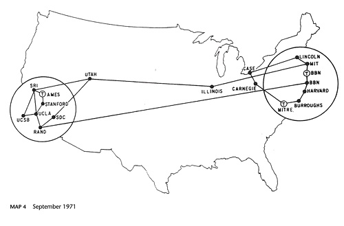

\thispagestyle{empty}
\begin{center}
\textsc{Centro de Investigación y de Estudios Avanzados}\\[0.5cm]
\textsc{Maestría en Ciencias de la Computación}\\[2cm]
\begin{center}
\huge\bfseries Tarea 1. Preguntas de reforzamiento de la Unidad I.
\end{center}
\vspace{2cm}
{\Large \textbf{Alumno}}\\[0.3cm]
{\normalsize \textbf{Moisés Alejandro Sánchez Vergara}}\\[0.3cm]
{\Large \textbf{Profesor}}\\[0.3cm]
{\normalsize \textbf{Dr. Eduardo López Domínguez}}\\[2cm]
3 de junio del 2026
\end{center}
\newpage

## Cuestionario

### ¿Qué papel desempeñó ARPANET en la creación de Internet?

**ARPANET**

En 1958, el gobierno de los Estados Unidos estableció la *Advanced Research Projects Agency* (ARPA), una agencia dependiente del Ministerio de Defensa integrada por aproximadamente 200 científicos de alto nivel y con un presupuesto considerable. Su principal objetivo era desarrollar mecanismos de comunicación directa entre computadoras para interconectar distintos centros de investigación.

En 1962, el ARPA puso en marcha un programa de investigación en ciencias de la computación bajo la dirección de John Licklider, investigador del Massachusetts Institute of Technology (MIT).

Para 1967, los avances acumulados fueron suficientes para que el ARPA presentara un plan formal para construir una red de computadoras: ARPANET. Este proyecto integraba las mejores propuestas de los equipos del MIT, el *National Physical Laboratory* (Reino Unido) y la Rand Corporation. La red fue expandiéndose progresivamente y hacia 1971 contaba ya con 23 nodos interconectados.

 

{fig-cap="Figura 1" width="550px" fig-alt="Puntos conectados de ARPANET en 1971"}

 

**De ARPANET a Internet**

En 1972, ARPANET fue presentada públicamente en la *First International Conference on Computers and Communication*, celebrada en Washington D.C. Durante el evento, los investigadores demostraron la operatividad del sistema mediante una red de 40 nodos distribuidos en diferentes ubicaciones, lo que impulsó notablemente el interés en el área y dio lugar a la creación de nuevas redes.

Entre 1974 y 1982 surgieron diversas redes relevantes:

- **Telenet (1974):** Primera versión comercial basada en ARPANET.
- **Usenet (1979):** Sistema abierto orientado al correo electrónico, que continúa en funcionamiento.
- **Bitnet (1981):** Red que interconectaba universidades estadounidenses mediante sistemas IBM.
- **Eunet (1982):** Red que enlazaba Reino Unido, Escandinavia y los Países Bajos.

Aunque el panorama de las redes era en ese momento bastante fragmentado, ARPANET continuaba siendo el referente predominante. En 1982, la adopción del protocolo TCP/IP por parte de ARPANET marcó el nacimiento formal de Internet (*International Network*).

### ¿Cómo se define la computación en Internet?

La computación en Internet se define a partir de **cuatro grandes aspectos** que la estructuran conceptualmente:

**1. Aplicaciones**
Son la variedad de servicios basados en Internet que se ofrecen a través de la red. Pueden dirigirse a distintos grupos de usuarios, desde el público en general (como redes sociales) hasta soluciones a medida para una organización específica (como sistemas ERP o de cadena de suministro).

**2. Arquitecturas**
Sientan las bases de las aplicaciones e incluyen dos dimensiones:

- *Arquitecturas de sistemas de información*: herramientas para capturar, describir y dividir aplicaciones complejas en partes manejables. Para ello, podemos recurrir a conocimientos previos sobre la arquitectura de los **SI distribuidos.**
- *Arquitecturas de Internet*: comprensión de los componentes clave de la red (ISPs, protocolos, infraestructura) que hacen posible la comunicación entre computadoras.
- *Middleware*: programas neutrales que median la comunicación entre aplicaciones, ocultando la complejidad de los sistemas subyacentes, infraestructuras, etc. Se distinguen tres tipos principales de middleware:

    1. middleware orientado a mensajes
    2. middleware orientado a transacciones
    3. middleware orientado a objetos.

**3. Tecnologías**
Las tecnologías cumplen cuatro principios:

- *Se aplican:* son medios practicables, no acciones realizadas “con las manos vacías”.
- *Son prácticas, no fines en sí mismas.*
- *Están incorporadas:* se manifiestan en el mundo material, no solo como ideas.
- *Son inteligentes, no ciegas.*

**4. Aspectos sistémicos**
Incluyen tendencias y paradigmas que informan el diseño de aplicaciones, como consideraciones éticas (confianza, privacidad) y la visión de Internet como sistema holístico.

### ¿Cuáles son las principales características de los Sistemas de Información distribuidos?

Los SI distribuidos presentan dos características fundamentales que los definen estructuralmente:

- *Autonomía de componentes.* Un sistema distribuido está conformado por una colección de ordenadores independientes cuyos componentes operan de forma autónoma entre sí.
- *Transparencia ante el usuario.* A pesar de estar compuesto por múltiples máquinas independientes, el sistema se presenta ante sus usuarios *ya sean personas u otros sistemas* como un único sistema coherente. Los desarrolladores deben ocultar las interacciones internas entre componentes para lograr esta percepción de unidad.

Adicionalmente, **los SI tienen una naturaleza sociotécnica (Orlikowski 1992)**: no solo comprenden software, hardware y datos, sino también las estructuras organizativas, las personas que los usan y las interacciones entre el sistema y sus usuarios en un contexto social.

### ¿Por qué son importantes los SI distribuidos para las aplicaciones basadas en Internet?

Por tres razones principales:

- **Primero**, debido a la naturaleza inherentemente distribuida de Internet, casi todas las aplicaciones basadas en ella son sistemas distribuidos, lo que hace inevitable su comprensión y correcto diseño.
- **Segundo**, los SI distribuidos permiten que las tecnologías de la información emergentes transformen la forma en que las empresas crean valor para sus clientes, facilitando actividades entre empresas e industrias a través de aplicaciones organizativas complejas.
- **Tercero**, dado que las aplicaciones basadas en Internet son regularmente sistemas sociotécnicos distribuidos que sirven a fines organizativos específicos, los conocimientos científicos generados por los investigadores de SI resultan cruciales para su desarrollo y funcionamiento.

### ¿Cuáles son los principales retos de diseño de los SI distribuidos?

- **Fiabilidad**. Capacidad del sistema para realizar satisfactoriamente su tarea durante un tiempo determinado y en un entorno específico. Los errores de software o hardware pueden causar fallos transitorios (recuperables) o persistentes (con pérdida irrecuperable de datos), lo que puede generar elevados costos para las organizaciones.
- **Escalabilidad**. Capacidad de un sistema para dar cabida a un número creciente de elementos y gestionar volúmenes de trabajo cada vez mayores. Las aplicaciones populares manejan decenas de miles de peticiones por segundo con demanda variable, por lo que el diseño arquitectónico y la base tecnológica elegida son determinantes.
- **Seguridad de la información**. Se divide en tres componentes: 

    - **confidencialidad**: garantizar que la información no sea revelada a personas, entidades o procesos no autorizados. 
    - **integridad**: la capacidad de proteger los datos frente a modificaciones o supresiones por parte de personas no autorizadas.
    - **disponibilidad**: garantizar que la información sea accesible en todo momento por los usuarios autorizados.

- **Integración**. Las aplicaciones basadas en Internet casi siempre combinan tecnologías y componentes heterogéneos. La integración se define como el proceso de vincular física o funcionalmente distintos componentes para que el sistema actúe como un todo coordinado.
- **Interoperabilidad**. Los usuarios acceden a las aplicaciones desde dispositivos muy diversos (PCs, móviles, estaciones de trabajo) con distintos sistemas operativos e interfaces. La interoperabilidad es la capacidad de dos o más redes, sistemas, dispositivos, aplicaciones o componentes para intercambiar y utilizar información de forma segura y eficaz con el mínimo de inconvenientes.
- **Usabilidad**. Factor clave para la aceptación del sistema por sus usuarios. Se conceptualiza en torno a tres aspectos: 
    - **eficacia**: capacidad de completar tareas y calidad del resultado.
    - **eficiencia**: relación entre eficacia y esfuerzo requerido.
    - **satisfacción**: reacciones subjetivas del usuario.

### ¿Describe tres ejemplos de aplicaciones basadas en Internet?

1. **Amazon**

  **Descripción general**

  Amazon es una plataforma de comercio electrónico masiva dirigida al público en general. Desde la perspectiva de la computación en Internet, constituye un SI distribuido de alta complejidad que integra logística, pagos, recomendaciones personalizadas y servicios en la nube, atendiendo simultáneamente a millones de usuarios en todo el mundo.

  **Arquitectura de software actual**

  Amazon opera bajo una arquitectura de microservicios, donde cada servicio es desarrollado, desplegado y escalado de forma independiente por su propio equipo. Los servicios se comunican a través de Amazon API Gateway para solicitudes síncronas y utilizan Amazon SQS para la mensajería asíncrona entre flujos de trabajo. Este diseño permite escalar recursos de forma independiente según la demanda, por ejemplo, asignando más recursos a un servicio de geolocalización sin necesidad de escalar todo el sistema. Desde el punto de vista de los retos de diseño del material del curso, esta arquitectura responde directamente a los desafíos de escalabilidad, fiabilidad e integración.

2. **SAP ERP (S/4HANA)**

  **Descripción general**

  SAP ERP es un sistema de planificación de recursos empresariales orientado al uso exclusivo dentro de organizaciones. Apoya funciones como finanzas, recursos humanos, logística y producción, siendo un SI distribuido de naturaleza sociotécnica que sirve a fines organizativos específicos.

  **Arquitectura de software actual**

  Lo que diferencia a S/4HANA es su diseño arquitectónico: mientras los sistemas ERP tradicionales requerían procesamiento por lotes nocturno, S/4HANA procesa todo en memoria, eliminando esas demoras. La plataforma combina funcionalidad ERP con inteligencia artificial integrada, ofreciendo a los departamentos financieros visibilidad del flujo de caja en tiempo real. La arquitectura de SAP S/4HANA se desglosa en varias capas: en la parte superior se encuentra SAP Fiori, el marco de interfaz de usuario que ofrece una experiencia consistente e intuitiva en múltiples dispositivos. La capa de aplicación es donde reside la lógica de negocio de SAP, procesando transacciones y garantizando la consistencia de los datos en todo el sistema. Esta arquitectura responde directamente a los retos de interoperabilidad, seguridad de la información e integración descritos en el curso.

3. **Spotify**

  **Descripción general**

  Spotify es un servicio de streaming de música y podcasts dirigido al público en general, disponible en múltiples plataformas. Como SI distribuido, debe gestionar millones de solicitudes simultáneas desde dispositivos heterogéneos, lo que lo convierte en un ejemplo representativo de los retos de escalabilidad, interoperabilidad y usabilidad.

  **Arquitectura de software actual**

  En su núcleo, Spotify opera bajo una arquitectura de microservicios: el sistema está dividido en partes independientes, cada una encargada de una función específica. Este diseño le otorga a Spotify control total; los equipos pueden construir, escalar o mejorar un servicio sin afectar el resto. Java es su lenguaje de programación principal, apoyado en el Spring Framework para gestionar la complejidad de las aplicaciones en la nube. Kafka, Cassandra y Kubernetes conforman la base tecnológica que permite el streaming global con baja latencia. Spotify también depende de una arquitectura orientada a eventos para hacer posible la personalización: cada perfil de usuario recibe recomendaciones generadas algorítmicamente. En 2024, construyeron un nuevo sistema basado en IA generativa para generar anotaciones sobre sus millones de canciones, videos y podcasts, lo que acelera el entrenamiento de nuevos modelos de machine learning.

## Referencias

- FIB - UPC. (s.f.). *Historia de Internet*. Facultad de Informática de Barcelona, Universidad Politécnica de Cataluña. Recuperado de https://www.fib.upc.edu/retro-informatica/historia/internet.html
- Okoone. (2025). How Spotify built the tech behind streaming millions of songs. Recuperado de: https://www.okoone.com/spark/technology-innovation/how-spotify-built-the-tech-behind-streaming-millions-of-songs/
- Amazon Web Services. (2025). What are Microservices? Recuperado de: https://aws.amazon.com/microservices/
- SAP. (2025). SAP S/4HANA Cloud. Recuperado de: https://www.sap.com/products/erp/s4hana.html
- Top10ERP. (2026). Understanding SAP S/4HANA: Core ERP Component of SAP's Cloud Strategy. Recuperado de: https://www.top10erp.org/blog/sap-s4hana