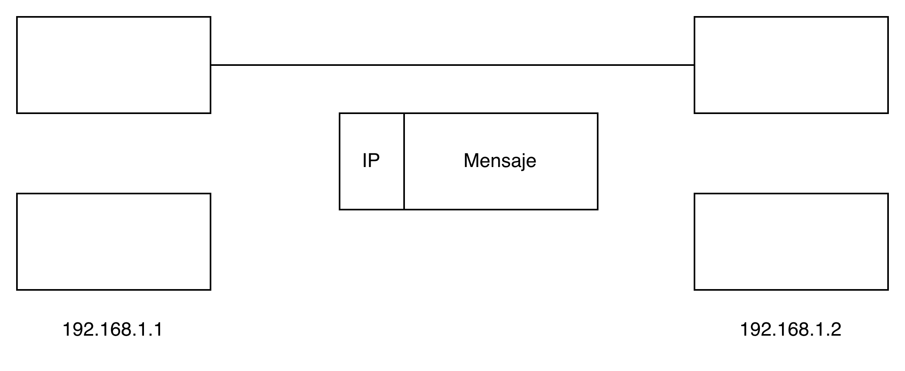
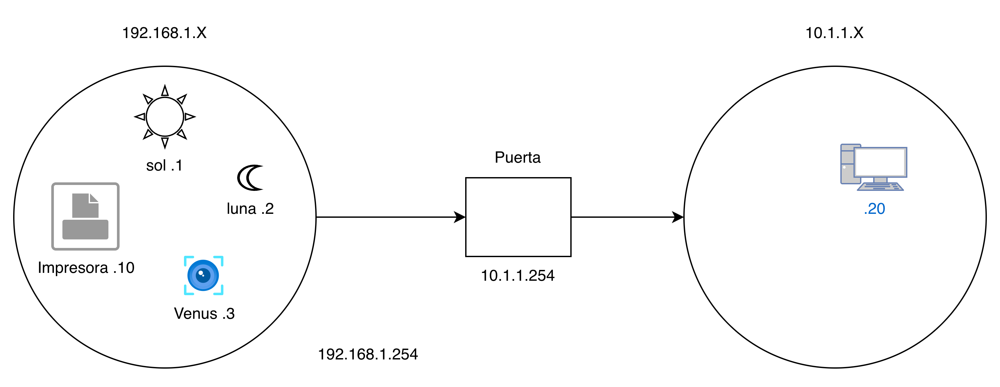

## **Duración:**

- **Inicio:** 6 de mayo
- **Término:** 6 de julio
- **Total de clases:** 10 clases
- **Horario:** Lunes y miércoles, 10:00 - 12:00 hrs.

## **Evaluación:**

| Criterio | Porcentaje |
|:---------|:----------:|
| Varias tareas | 60% |
| Examen | 40% |

## **Contenido:**

En este curso abordaremos los siguientes temas:

- Construcción de redes.
- Implementación en máquinas virtuales.
- Configuración de cortafuegos.

Un cortafuegos, o en general cualquier servidor, debe tener el software mínimo necesario para ejecutar esa aplicación. En consecuencia, configuraremos máquinas Linux optimizadas para este propósito. 


---

## **Redes TCP/IP**

### **Protocolos IP**

| Protocolo | Versión | Características |
|:----------|:--------|:----------------|
| IPv4 | Versión antigua | Direcciones de 32 bits; ampliamente utilizado, pero con direcciones disponibles limitadas. |
| IPv6 | Versión nueva | Direcciones de 128 bits; permite una mayor cantidad de direcciones disponibles en comparación con IPv4. |

### **Velocidades de Ethernet**

| Tipo | Velocidad |
|:-----|:--------:|
| Ethernet | 10 Mbps |
| Fast Ethernet | 100 Mbps |
| Gigabit Ethernet | 1 Gbps |

<br>
<div style="text-align:center">
{fig-cap="Figura 1: Diagrama de Internet" width="500px" fig-alt="Diagrama de Internet."}
</div>
<br>

### **Direccionamiento IP**

El identificador de cada computadora es un número de 32 bits en IPv4, compuesto por 4 octetos (ff.ff.ff.ff), donde cada octeto va de 0 a 255.

**Rangos de direcciones privadas:**

| Rango | Uso |
|:------|:----|
| 192.168.X.X | Redes privadas clase C |
| 10.X.X.X | Redes privadas clase A |
| 172.16.X.X | Redes privadas clase B |


### **Concepto de Switcheo de Paquetes**

Todas las computadoras dentro de una red **ven** todos los paquetes. Este concepto se denomina "switcheo de paquetes". No hay buzones en redes **TCP/IP**.

### **Puertos**

Los puertos utilizan 16 bits para su identificación.

| Tipo | Rango | Cantidad |
|:-----|:-----:|:---------:|
| Total de puertos | 0 - 65535 | 2^16 - 1 = 65,535 puertos disponibles |
| Puertos reservados | 0 - 1023 | 2^10 - 1 = 1,023 puertos reservados |
| Puertos de usuario | > 1023 | Disponibles para aplicaciones del usuario |

**Ejemplos de puertos y servicios comunes:**

| IP:Puerto | Servicio |
|:----------|:---------|
| 192.168.1.50:80 | HTTP |
| 192.168.1.50:22 | SSH |
| 192.168.1.50:53 | DNS |
| 192.168.1.50:443 | HTTPS |


<br>
<div style="text-align:center">
{fig-cap="Figura 2: Diagrama de Tráfico" width="500px" fig-alt="Diagrama de Tráfico."}
</div>
<br>

### **Puerta (Gateway)**

Una puerta de enlace es un dispositivo que conecta redes diferentes. Sus características principales son:

- Al menos dos tarjetas de red.
- Cada tarjeta se conecta a una red diferente.
- Se debe activar el traspaso de paquetes entre las tarjetas.

**Flujo de tráfico:**

```
Entrada ➔ (Traspaso) ← Salida
```

**Definición:** Todo el tráfico que no venga dirigido hacia la computadora es el **traspaso**.

---

## **/etc/hosts**

El archivo `/etc/hosts` permite mapear direcciones IP con nombres de host. A continuación, se muestra un ejemplo de configuración:

| Dirección IP | Nombre de Host |
|:-------------|:---------------|
| 127.0.0.1 | localhost |
| 192.168.1.1 | sol |
| 192.168.1.2 | luna |
| 192.168.1.3 | venus |
| 192.168.1.10 | impresora |

---

## **DNS (Sistema de Nombres de Dominio)**

Los servidores DNS resuelven nombres de dominio a direcciones IP.

**Servidores DNS configurados:**

| Servidor DNS |
|:-------------|
| 148.247.102.1 |
| 148.247.102.15 |

## Tarea 1 (Paso 1 y 2)

### Sistema minímo
1. Núcleo

    /etc/boot

2. Arrancador

    El Torito para CDs -> grub

3. Ambiente donde vivirá el sistema opetativo

    * Busybox, todos los ejecutables cd, ls, plub, cat, vi
    * Mismas bibliotecas compartidas del sistema linux donde se obtuvo el núcleo 

### Directorio

* etc
* bin
* lib
* usr
* dev
* usr/bin


Nececistamos
    * los archivos de los dispositivos en dev
    * configuraciones en **/etc/host**

### Arranque en Linux

* Configura el hardware tipo de CPU, memoria, dispositivos
* El archivo del ambiente lo descompone en memoria
* Cambia el archivo raíz al disco duro → X

### Configurar la red

|Comando|Descripción|
|:-----|:-----------|
|ifconfig|Configura la interfaz de red|
|route|Configura la tabla de enrutamiento|
|ip|Configura la red (reemplazo de ifconfig y route)|


