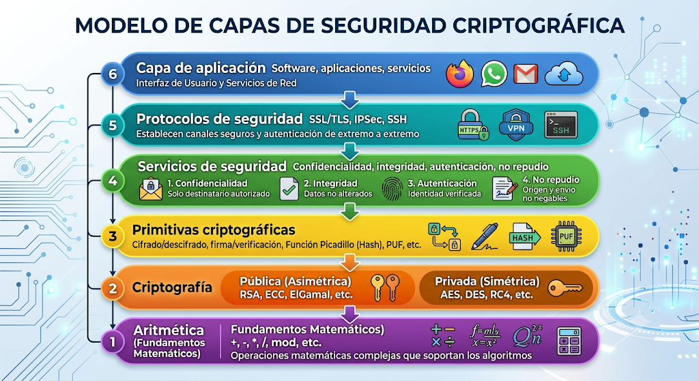
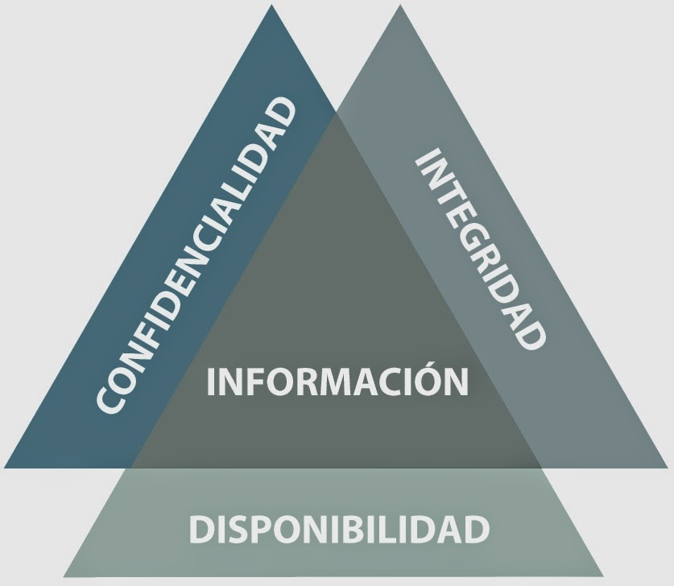

## ¿Qué es la seguridad?

- **Estar libre de daños, riesgos.** 
- **Protección de una persona o cosa contra daños, riesgos o ataques.**

La práctica de defender información de accesos no autorizados, uso. revelación, ruptura, modificación, inspección, grabación, destrucción.

Involucra la creación, las operaciones, análisis y pruebas de sistemas de cómputo seguros.

Incluye aspectos de:

- Ley
- Política
- Factor humano
- Ética
- Riesgos de administración

## Fundamentos de seguridad informática

- **Criptografía.** Mecanismos y algoritmos básiucos para la protección de información.
- **Protocolos seguros.** Servicios de autenticación, comunicaciones seguras y transacciones.
- **Infraestructua de llave pública (PKI).** Generación, distribución y administración de certificados de llave pública.
- **Políticas de administración de servicios.** Servicios de autorización y control de acceso, políticas y norma de seguridad.

## Modelo de capas para sistema de seguridad

<!-- 
- **Capa de aplicación.** Software, aplicaciones, servicios.
- **Protocolos de seguridad.** SSL/TLS, IPSec, SSH.
- **Servicios de seguridad.** Confidencialidad, integridad, autenticación, no repudio.
- **Primitiva criptografícas.** Cifrado/descifrado, firma/verificación, Función Picadillo, PUF, etc.
- **Criptografía.**

    - **Pública.** RSA, ECC, ElGamal, etc.
    - **Privada.** AES, DES, RC4, etc.

- **Aritmetica.** +, -, *, /, mod, etc.
-->
 

{fig-cap="Figura 2" width="350px" fig-alt="Modelo de capas para sistema de seguridad"}

 

## Limites para proveer seguridad

- No existen sistemas absolutamente seguros.
- El usuario necesita hacer uso de la seguridad, pero no tiene ningún conocimiento.
- El usuario no tiene control sobre la seguridad, pero es el responsable de su uso

    - Solución: Niveles de seguridad predefinidos y clasificados de acuerdo a algún criterio de grupo.

- Para reducir su vulnerabilidad a la mitad se tiene que doblar el gasto de seguridad
- Los intrusos brincan la criptografía, no la rompen. ¿Cómo?

**¿Qué es un ransomware?** El ransomware (que proviene de la combinación de las palabras en inglés ransom, que significa rescate, y software) es un tipo de programa malicioso (malware) diseñado para secuestrar datos. 

## Triada CIA

 

{fig-cap="Figura 2" width="350px" fig-alt="Triada CIA"}

 

**Confidencialidad.** 

*¡Que no se revele información a quien no está autorizado!*

Garantiza que la información solo sea accesible para las personas autorizadas. Protege los datos en cualquiera de sus tres estados: en almacenamiento, en proceso o en trásito.

**Integridad.**

*¡Que los datos no sean alterados!*

Garantiza que la información solo sea accesible para las personas autorizadas. Protege los datos en cualquiera de sus tres estados: en almacenamiento, en proceso o en trásito.

La integridad se debe analizar desde 3 perspectiva:

* Prevenir que alguien con permisos de modificación cometa algún error y modifique los datos.
* Prevenir que alguien sin permisos de modificación realice algún cambio.
* Prevenir que algún programa o aplicativo que interactúa directamente con la información *objetivo* realice algún cambio.

**Disponibilidad.**

*¡Que la información siempre esté accesible para las personas autorizadas!*

## Servicios de seguridad

- **Confidencialidad.**
- **Integridad.**
- **Disponibilidad.**
- **Autenticación.** 
- **Identificación.**
- **No repudio.** 
- **Control de acceso.** 

- La autenticación de identidad. Asegura que la identidad de los participantes es verdadera.

  * Algo que el usuario tiene (llave)
  * Algo que sabe (contraseña)
  * Algo que el usuario es (huella digital)

## Tipos de autenticación

- **Autenticación del mensaje.** Consiste en la verificación de que una de las partes es la fuente original del mensaje:

  * Autentica la procedencia de un mensaje.
  * Asegura la integridad del mensaje.
    
- **Autenticación de transacción**

  * Provee autenticación de mensaje.
  * Garantiza la existencia única y temporal de los estados.

## Romper un criptosistema

Algunos puntos donde se pueden romper:

- **Implementacion.**
- **Administración de llaves**
- **Los usuarios.**

## ¿Qué es la criptografía?

**TAREA:** *Ver 'El código enigma'*

## Criptoanálisis

## Ataques de seguridad 

**Activos**

- Modificación del mensaje.
- Denegación de servicio.
- Impersonar.
- Ataque físico. 

**Pasivos**

- Análisis de tráfico.
- Divulgación de información.

**Errores de desarrollo hardware/software**

## Servicios qie proveen las primitivas básicas

- Cifrado/Descifrado - Confidencialidad.

  - Dependiendo de su aplicación: autenticación e integridad.

- Funciones hash - Integridad.

  - Dependiendo de su aplicación: autenticación. 

- Firmas digitales - Autenticación y no repudio.

  - Dependiendo de su aplicación: asegurar la integridad del mensaje.

