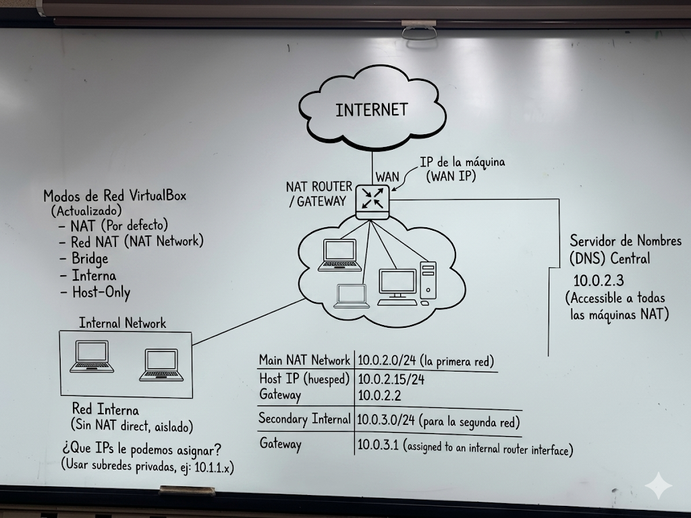
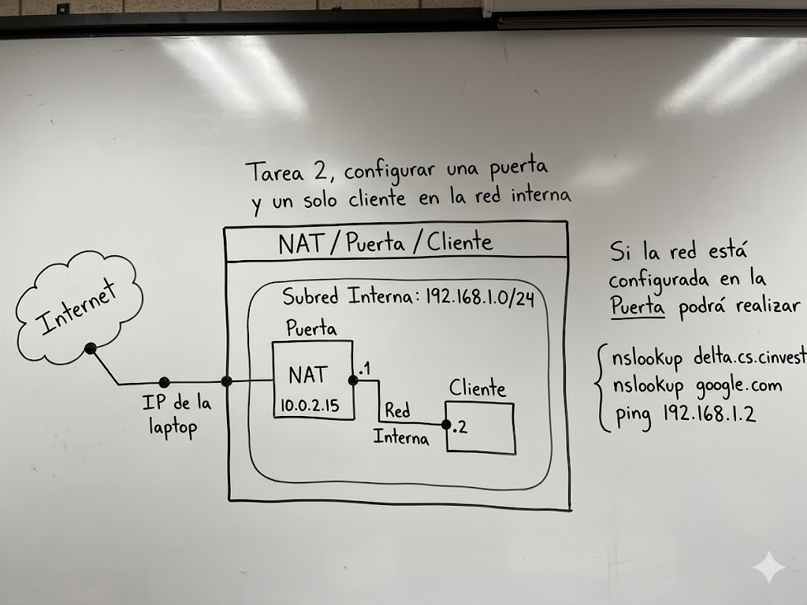
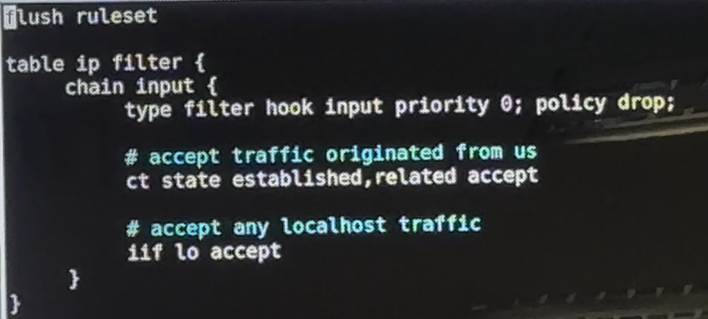
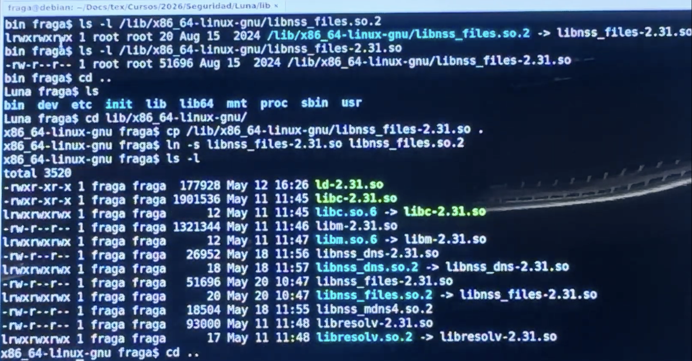
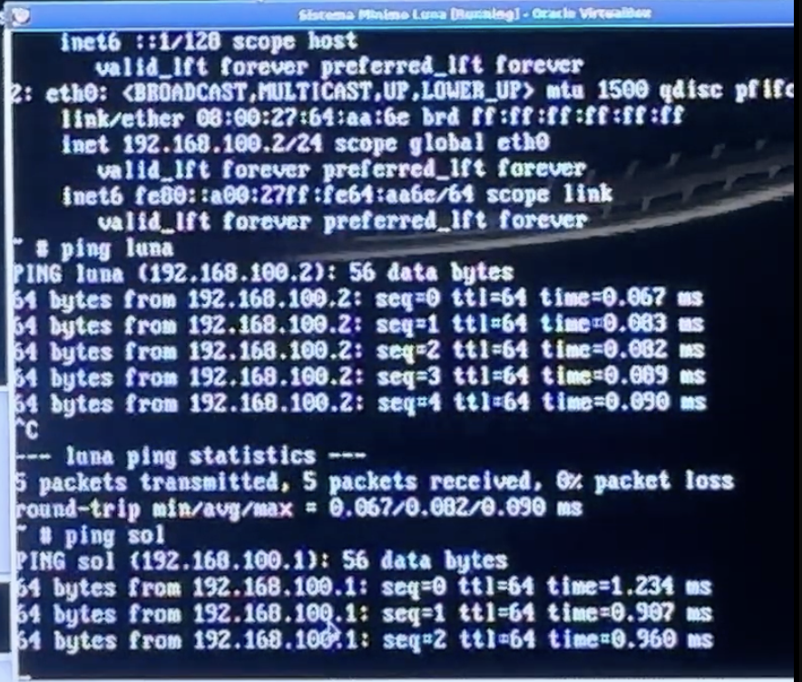
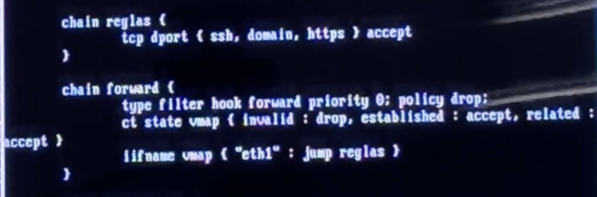
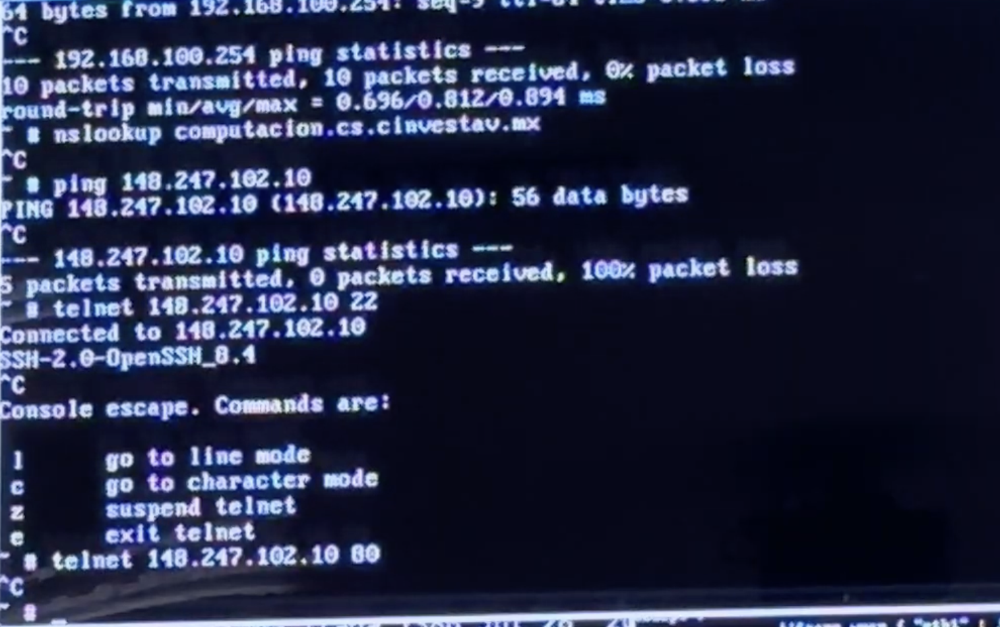

Directorio proc, ¿qué es? 

El directorio /proc es un sistema de archivos virtual (procfs) provisto por el kernel de Linux que expone información y control del kernel y de los procesos en forma de archivos y directorios. Puntos clave:

* No está en disco; es dinámico y refleja el estado del kernel en tiempo real.
* Contiene entradas por PID (/proc/<pid>) con info del proceso (cmdline, status, fd, etc.).
* Archivos comunes: /proc/cpuinfo, /proc/meminfo, /proc/uptime, /proc/loadavg, /proc/modules.
* /proc/sys ofrece parámetros del kernel que pueden leerse y, en muchos casos, modificarse (por ejemplo via sysctl).
* Montado en el arranque (tipo proc); útil para diagnóstico y monitorización.
* Precaución: escribir en /proc puede cambiar el comportamiento del sistema — hacerlo solo si sabes lo que haces.

```
# Ver información de la CPU
cat /proc/cpuinfo

# Ver memoria
cat /proc/meminfo

# Información del proceso actual
ls -l /proc/$$
cat /proc/$$/cmdline
```

## Modulos de red de virtual box

* NAT
* Interna


<br>
<div style="text-align:center">
{fig-cap="Figura 1: Diagrama de Internet" width="600px" fig-alt="Diagrama de clase."}
</div>
<br>

<br>
<div style="text-align:center">
{fig-cap="Figura 1: Diagrama de Internet" width="600px" fig-alt="Diagrama de clase."}
</div>
<br>

### ¿Qué es virtio? 

Virtio es un conjunto de dispositivos paravirtualizados y un framework de E/S para máquinas virtuales (principalmente KVM/QEMU) que ofrece interfaces estándar entre el invitado (guest) y el host para mejorar rendimiento frente a la emulación completa.


### Gateway
Un gateway (o puerta de enlace) es un dispositivo o programa de red que actúa como puente o traductor entre dos redes distintas. Su función principal es recibir datos de una red local, traducirlos y enviarlos a la red de destino (como Internet) para que la comunicación sea posible.

`cat /etc/FW.rules`

`cat /etc/servidor.rules`


`cat /etc/sinFW.rules`

<br>
<div style="text-align:center">
{fig-cap="Figura 1: sinFW.rules" width="600px" fig-alt="sinFW.rules"}
</div>
<br>

`libnss_files.so.2`

<br>
<div style="text-align:center">
{fig-cap="Figura 1: libnss_files.so.2" width="600px" fig-alt="libnss_files.so.2"}
</div>
<br>

<br>
<div style="text-align:center">
{fig-cap="Figura 1: ping_luna_sol" width="600px" fig-alt="ping_luna_sol"}
</div>
<br>

`lsmod` comando para listar los módulos del kernel cargados en el sistema. Muestra información sobre cada módulo, como su nombre, tamaño y dependencias. Es útil para diagnosticar problemas relacionados con controladores y hardware.

`nft -f FW.rules` comando para cargar un conjunto de reglas de firewall desde un archivo llamado FW.rules utilizando nftables. Este comando aplica las reglas definidas en el archivo al sistema, configurando el firewall según las especificaciones proporcionadas.

`nft list ruleset` para mostrar las reglas de firewall actualmente activas en el sistema. Este comando es parte de nftables, una herramienta moderna para la gestión de firewalls en Linux, y proporciona una visión detallada de las reglas que están en vigor.

<br>
<div style="text-align:center">
{fig-cap="Figura 1: reglas" width="600px" fig-alt="reglas"}
</div>
<br>

<br>
<div style="text-align:center">
{fig-cap="Figura 1: pruebas_reglas" width="600px" fig-alt="pruebas_reglas"}
</div>
<br>