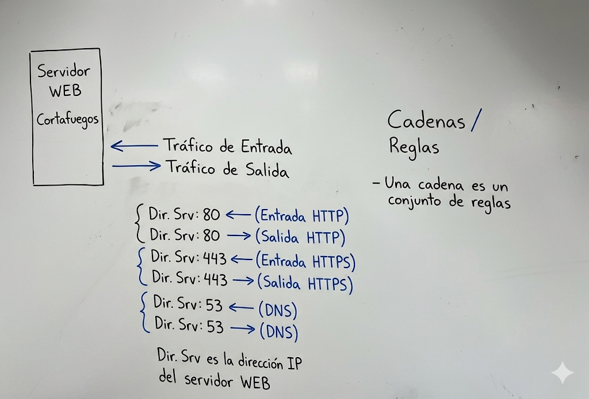
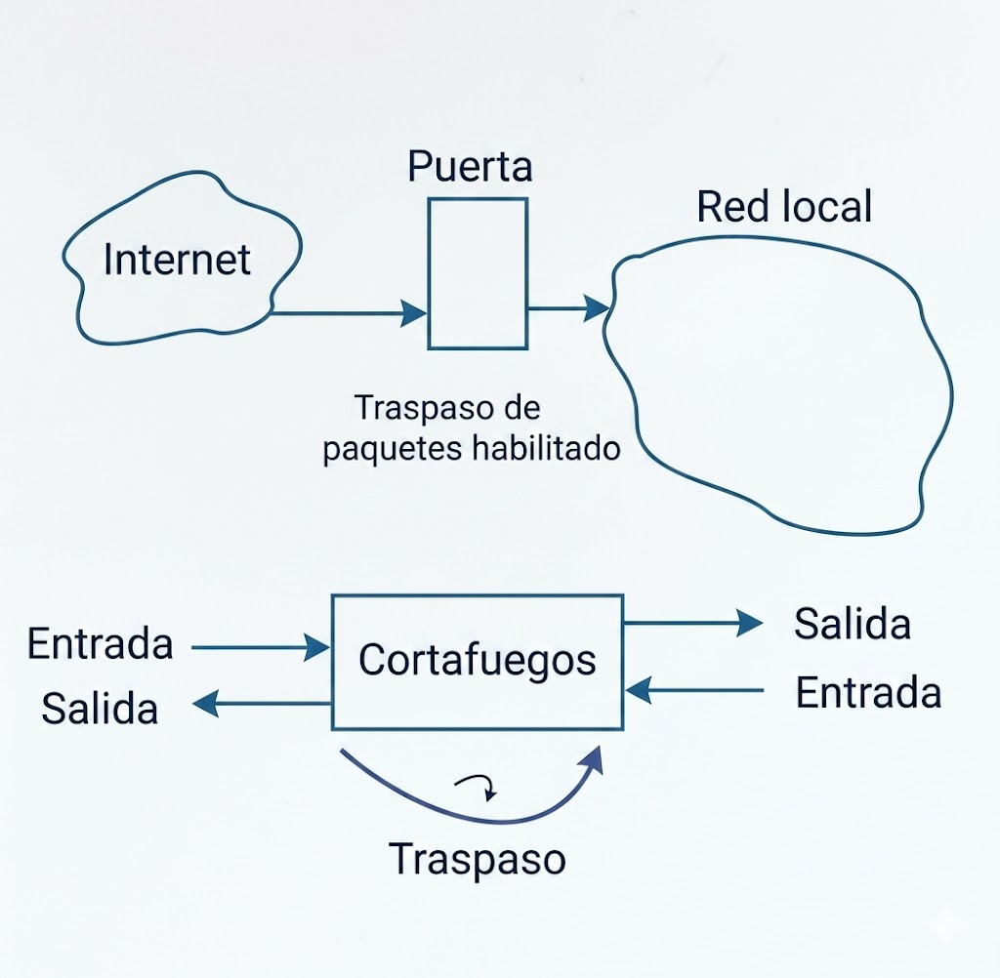
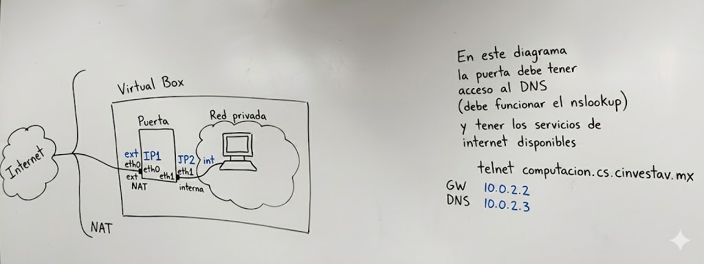

## Vamos a hacer cortafuegos

### Por el protocolo TCP/IP podemos filtrar

* Direcciones IP
* Redes
* Servicios
* Inicios de sesión


Se deben cerrar todos los servicios, redes, direcciones, se bloquea todo y se abren lo que se requiera.

Para que exista red:
|Nombre|Puerto|
|---|---|
| Servidor de nombres| 53 |
| SSH | 22 |
| WEB | 80 |
| WEB Seguro | 433 |

<br>

<br>

<br>

<br>

Si se habilita las traducciones de direcciones, las máquinas en la red local podrán acceder a Internet usndo IP1

NFTables
iptables

```txt

18.05.2026

nftables es el paquete para manejar
la realización de cortafuegos

nft es el comando para administrar 
las reglas del cortafuegos
Necesitamos el comando 'nft',
las bibliotecas compartidas y 
los módulos necesarios.

- Una idea es copiar todos los módulos del núcleo y automáticamente levanta los modulos necesarios el mismo comando nft


```

<br>

<br>
 
