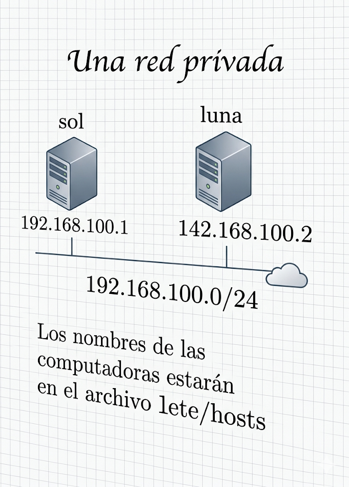
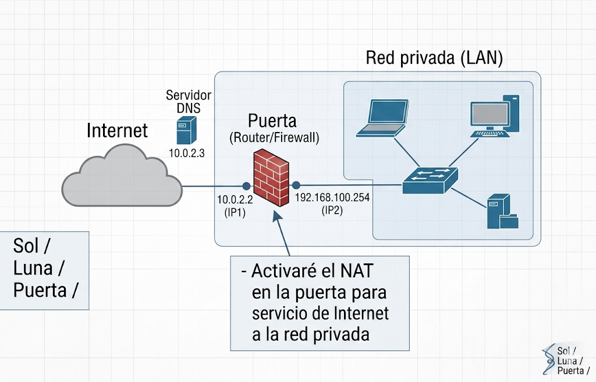

## Una red privada

|Sol|Luna|
|---|---|
|192.168.100.1|192.168.100.2|

192.168.100.0|24

 

 

Los nombres de las computadoras estarán en el archivo `/etc/hosts`

 

 

- Sin activar el traspaso de paquetes
- Activando el traspaso de paquetes
- Activando NAT
